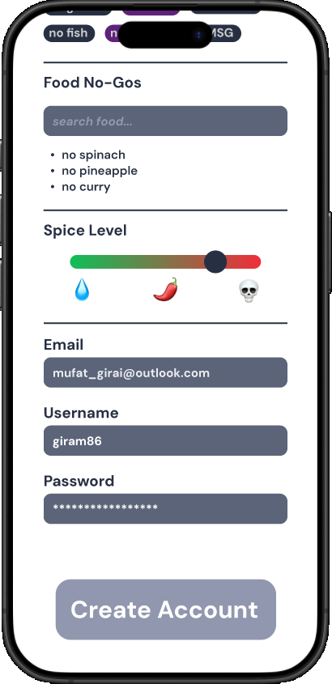
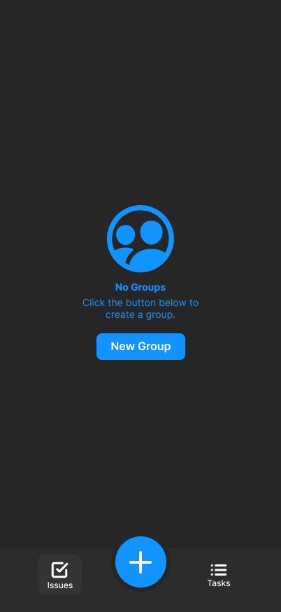
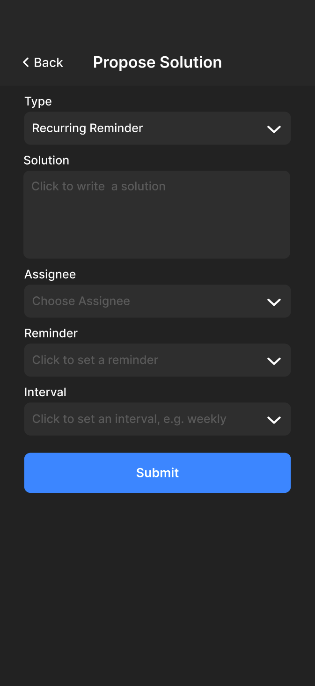
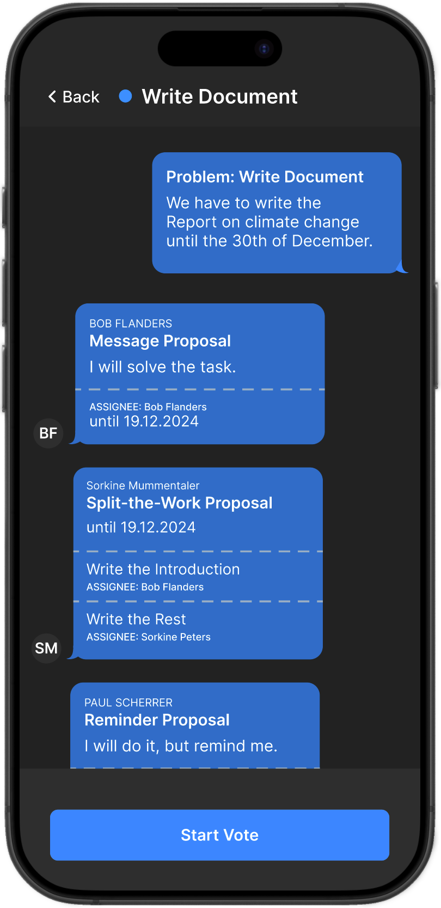
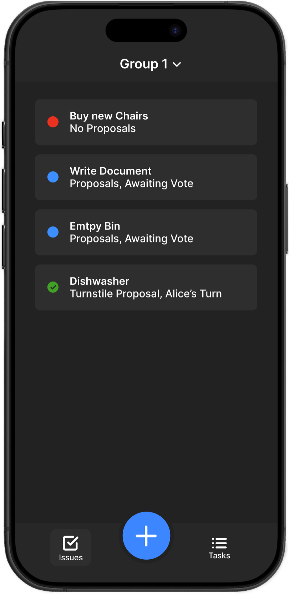
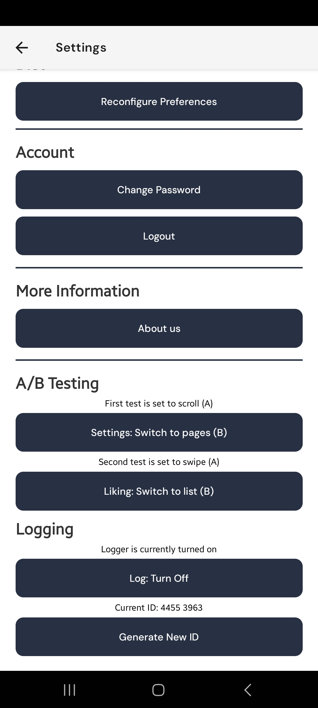
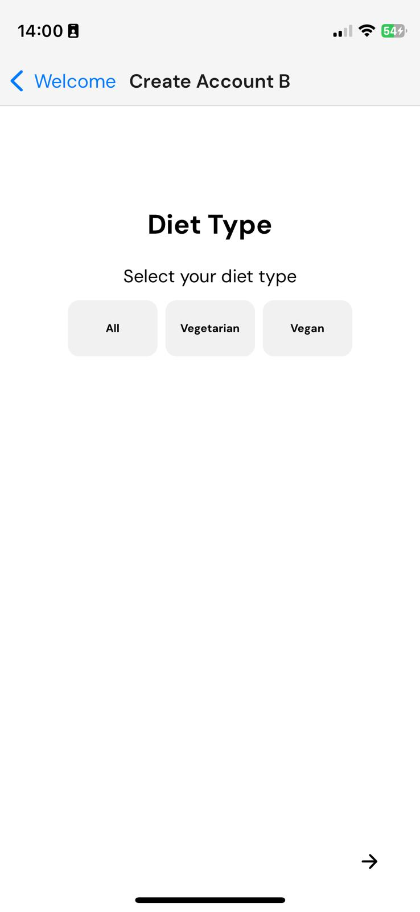
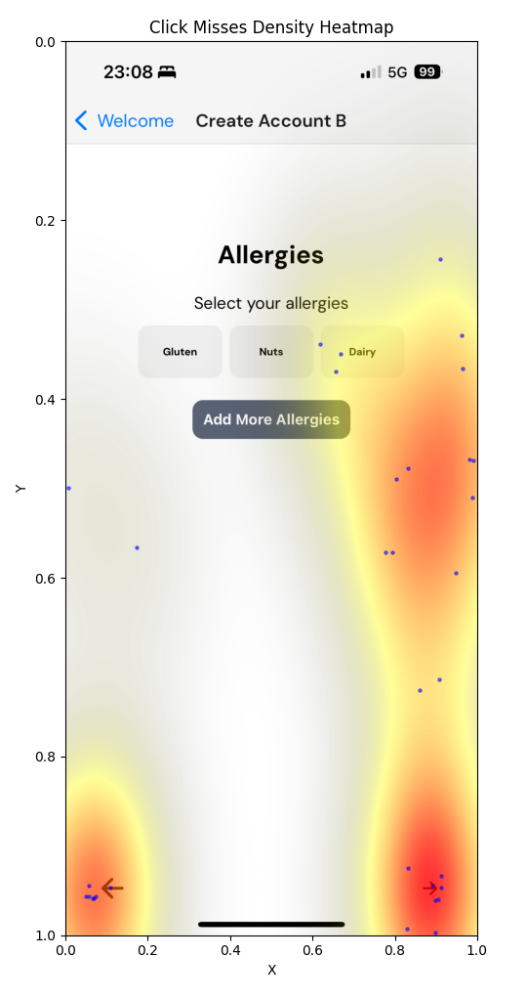

[](https://classroom.github.com/a/rcN7gEKM)
<p align="left" width="100%">
  
  
</p>

# Nip it in the bud, Group 8

## Project description

With _"Nip it in the Bud"_ we tackle the issue of the often innocuously meant transfer of mental load in decision-making.

## Preamble - The Preemptive Ideation

Before we met with our TA, our idea of what we had to do was quite different from what we should be doing. And so it went that after finding ourselves with the group we had decided to form and nothing else, we set out to find an idea that we could apply the principles of human-computer interaction to the development process. We came together and agreed that a kind of “Tinder for restaurants” would be great for reducing mental load.

One talk with our TA later and there we were again, finding ourselves with the group we had decided to form and nothing else. Well, nothing might be a little overdramatic, because something we did gain, which turns out to be quite important, was an understanding of what we had to do.

## Needfinding

### Interview

#### Questioning the Questions

Knowing that the interview questions were without question the next thing we had to tackle, we came together to find the unquestionably best questions.

In a group meeting of six, we did what a group of six does best without having a concrete plan; we discussed how we should structure the questions, and through some impromptu interviewing of bystanding students, we found a direction and a rough draft of our questionnaire.

To then craft the finest our group had to offer, we separated into two groups: the finessers, and the ones that had to attend their lectures.

The finessers went out to finess, and with the finest they were able to produce. In finessing the questions we put particular focus on finding situations in the interviewees’ day-to-day lives, especially in recreationally social situations. To be able to inquire about such situations we paid close attention to avoid suggestive questions, using wording that intuitively refers to personal life, and trying to let the interviewee talk about their life.

We structured the questionnaire, such that we start with questions gathering the genius of unconcerned thoughts about tasks and responsibilities in everyday life, to then have a slow increase in reflectiveness throughout the later questions.

To assess possible strengths and weaknesses of the questionnaire, they conducted three explorative interviews.

One went very well with almost superfluous answers, the next was quite short with the interviewee expressing nothing but joy about any and every situation, and the last, which went about to expectation.

With some slight edits, we talked to our TA to judge whether the questionnaire matches up with what the needfinding tries to achieve. Settling on the questionnaire into its final form.

[Interview Questionnaire - German](/Deliverables/Needfinding/Interviews/Questionnaire/interview_de.pdf)

[Interview Questionnaire - English](/Deliverables/Needfinding/Interviews/Questionnaire/interview_en.pdf)

[English Questionnaire with Justifications](/Deliverables/Needfinding/English%20Questionnaire%20with%20justifications.pdf)

#### Asking the people

And so we went asking the people that were willing to give an interview and we tried to have a somewhat diverse selection of interviewees. We also tried to have an entrusting atmosphere during the interview, this was helped by the fact that the interviewer knew the respective interviewee.
The people we ended up interviewing do not substantiate a representative sample of the entire populus, but we do have a good representation of young people with diverse educational, economic, and social backgrounds. This leads us to have a sample of young people who are open to new technologies, and who are more likely to spearhead new societal movements and changes, such as utilizing an app in a previously established way of dealing with a problem.
We have to be careful not to extrapolate to the entire demographic spectrum but to have a more detailed perspective on our subset.

## Ideation

### Desk Research

Several apps match the needs we found from our interviews. But one of them, Pick and Eat matches it the best. It allows the user to specify allergies and exclude cuisines and an AI will decide it for you. The thing is that it still has not launched yet and the ad does not work with the description. One solution to overcome this is to implement it and adapt to this idea. 

The other one that is highly relevant is DecideAI, which can make multiple decisions like food, restaurants, and activities. This sounds good but unfortunately after inspecting the app more closely, it appears like a fancy random generator. It does not include user preferences, wishes, and multiple people. So a solution would be built on top of this.

Another important Desk Research finding was the paper The Role of Information. It shows what typical users value more or less in deciding on restaurants. Some key points are for example food quality or food type. This paper can be easily adapted in our app to decide what restaurant to decide for the user if we implement a restaurant app.

<p align="left" width="100%">
  
  
  
  
  <figcaption> (Left: Pick and Eat, Middle: DecideAI, Right: Research Paper) </figcaption>
</p>

### How Might We

1. How might we improve time efficiency in decision-making?
2. How might we resolve dietary restrictions in groups?
3. How might we make decision-making more fair?
4. How might we improve communication in big groups?
5. How might we ensure that everyone is involved in decision-making?
6. How might we help balance work and life?
7. How might we reduce stress in decision-making?
8. How might we decide on a restaurant more easily?

### Brainstorm

When we received a warning for a category 4 brainstorm, we decided to utilize a mindmap to capture the ideas. The brainstorming started with capturing all ideas that came to our minds, by placing a post-it on our [Miro board](https://miro.com/app/board/uXjVLVHk59E=/?share_link_id=266265026404).

<p align="left" width="100%">
  
</p>

We made connections between related post-its and talked about different aspects. We analyzed the storm, and each presented some ideas we had based on the mindmap.

[Brainstorm.pdf](https://github.com/eth-hci-course/hci-project-2024-hci2024-group-08/blob/2024/Deliverables/Ideation/Brainstorm.pdf)

## Low-fidelity Prototype

After selecting the finest of ideas, we went ahead to create something the world has never seen before, low-fidelity storyboards for use-cases of the ideas.
We decided that a photo story would be most fitting for our purposes as we were able to visualize our stories time efficiently, it allowed us to clearly show the use-case and gave us a first mental note on how they might work in social situations.

### Storyboards

#### Storyboard 1 - Retiree Rudi

In this scenario, the focus was on people who were long enough the leader and now somewhat forgetful. When the job requires needing to speak up and make decisions, then the desire to just follow someone's lead can get high. Also in the household, it can be hard to not forget important tasks. This app should reduce the mental load on planning and reminding tasks in large groups and households.

#### Storyboard 2 - Student Sara

In this scenario, we wanted to highlight how it is sometimes hard to speak up for your own needs, as you do not want to upset anyone. This app should help people who do not want to take the lead but want to give some input and suggestions. It can be cumbersome to research several restaurants and need to check if everyone likes it, and if there are for example gluten-free options. This is sometimes hard in smaller cities. This app should reduce the stress of feeling like a burden.


#### Storyboard 3 - Worker Wilma

Some people like to make decisions and take the lead. But is this good for the group? Often, people wish for a democratic approach and everyone should be equally involved. This can be sometimes hard for people who just overrule others. That is the reason for this app idea, where voting and making a decision becomes easier. Thus reducing the workload of everyone and reducing the stress of being afraid to speak up.


### Paper Prototype Foodecidr

So the paper prototype was designed to show what a possible layout of the Foodecidr app could look like. The focus was a simple structure. Some example images can be seen here:


Watch the full prototype video here: ([polybox-link](https://polybox.ethz.ch/index.php/s/Vb23kBhjfy7fSwi))

The colors were mostly black and white. Red and green were only used to show who was already done in the app.
In the end, three different approaches were drawn to see what was possible and what was more cumbersome.

- UN Security Council:
  - Each group member has one veto. If they hate the restaurant they can veto it and a new restaurant gets chosen. This consumes their one veto for the event. This continues until nobody's vetos or all vetos are used up.
- MAT strategy:
  - If the users are not satisfied, they can choose which of the three restaurants is the best, second best, and worst. This also has its pros and cons that need to be worked out: what to do if there is a tie?
- Swiping:
  - If people want something different, they can swipe through their options and decide if they want to go there or not. If a restaurant is liked by all participants, it will be chosen.

The prototype identifies several user needs. One of the needs mentioned was "time efficiency." People like democratic decisions, but they don't like the constant back and forth. The app Foodecidr will reduce the decision-making time significantly. Another need was that everyone should be involved. Each user can select their allergies and dislikes so that only restaurants that avoid them are shown, ensuring that everyone can provide input. The last need that was addressed was allergy and food intolerance in general. Often people have a hard time finding food that meets their needs. This app should also help them find options in a short amount of time.

### Paper Prototype MindSupport

The idea of _MindSupport_ is, to allow a group of people to submit mental workload issues they discover to their group. In the second stage, the group then has to propose a solution, which is then voted on. 

<p align="left" width="100%">
  
  
  
  
</p>

In the images one can see the two stages, how the user first creates a mental workload issue for the group and secondly allows the other group members to propose a solution (or multiple solutions which later get voted on democratically).

A solution can be of type:

- **Message**: Propose a solution in text format with a deadline and an assignee for one-time issues (e.g. "I will write the section about climate impact until Monday.")
- **Split the Work**: Similar to a message, but one can split the work by writing a short description of each sub-task and assigning a person.
- **Reminder**: Propose a reminder, along with some text and an Assignee, also meant for one-time use (e.g. "We have to hand in the project on the 16th of October, Bruno will zip the whole repo and upload it.")
- **Recurring Reminder**: Propose a reminder that can repeat in a certain interval, one sets initial assignee and then every time the assignee will rotate in the group (e.g. "Clean the floor every month.")
- **Turnstile**: For solving recurring tasks without a date, every time it's marked as done, it will be passed on to the next person, an initial assignee is also required (e.g. "Empty the Dish Washer, I will do it for the first time.")

The whole interaction can be seen in more detail in [this video](https://polybox.ethz.ch/index.php/s/84EzmTnbguY70mu). Reflecting upon the paper prototyping, we did too many components, it sometimes would have been simpler to just do the whole screen again. Also, I believe we went a bit too much into the details in this paper prototype.

This concept tries to address multiple of the above "How might we..." questions and needs we found in the interview. Firstly, it aims to ensure that everyone is involved in the decision-making, as in the end an issue is only resolved after a completed anonymous vote. It also allows people to speak up and bring up a mental load issue, which might otherwise be too shy to bring up an issue. To improve this one could evaluate the effect of making the publisher of the issue anonymous. We also try to make decision processes more fair by allowing the counterpart to propose a solution and making a democratic vote, we ensure most of the group is happy with the decision. Again, one could evaluate another option of giving the user who created the issue a veto, to ensure that the person who was affected by the issue is also happy with its outcome. Another big point we try to streamline is communication in big groups, this app is not aimed to be an app just for households, it can be used for any kind of decision process in small to large groups. All proposals are forced to be in the same format, e.g. if multiple people propose to split the work a poll can be automatically generated to allow all members to vote on those proposals, this removes all the clutter of large group chats. This shift from usually having one leader decide on something towards outsourcing it to the group in a streamlined fashion should also help to reduce stress in decision-making. We hope that this removes peer pressure and allows people to decide on their own, thus making decisions that improve work-life balance, which is also reinforced by keeping the load evenly shared among all parties.

## Reflection - The Mirror of Retrospection

Standing in front of the mirror, I realize that it might be helpful to look behind and get a rough understanding of how things played out.

1. We found ourselves as a group
2. We met up to discuss which topic preferences we wanted to choose
3. We had a meeting with our TA over Zoom
4. We met up to create the questionnaire
5. We started taking our interviews
6. We talked with our TA again
7. Finished with interviews and summaries
8. The big day

Overall we started quite wrong and inefficient.

When we discussed our topic preferences, we also talked about concrete ideas for problems we thought would be worth solving, only after realizing that that would skip the entire need-finding step. To improve on this, we should question our understanding of the task more, and read the task description in more detail. Also, see [Preamble - The Preemptive Ideation](#preamble---the-preemptive-ideation).

The meeting with our TA cleared up quite some things.

When we met up to discuss the questionnaire, we had 3 rough drafts from different group members. We talked in the entire group about the questionnaire and what it should look like. While this meeting felt at times, as if we were making no progress, in retrospect I can confidently say that it greatly strengthened the understanding of the task and our goal for the entire team. Finishing the wording in a smaller group also allowed us to hone in on some of the linguistic and structural challenges of the questionnaire. Also, see [Interview](#interview).

When we talked to our TA again, we had done 3 test interviews and 2 interviews with the final questionnaire. With the recommendation of our TA, we decided on two roles the organizer, and the blogger.

This was a much-needed change in group structure as it allowed us to make a concrete plan. With that plan, we went ahead and took our interviews. The plan was changed quite a bit after realizing that there was still a lot of work to do, and with a large part of the group not being available the next few days due to other commitments, we decided on the big day.

The big day is a Tuesday, 2 days before the deadline, for which we decided we would meet up at 8 am and get stuff done. This allowed us to do the work that was only possible with the entire group present and also allowed for quick collaboration when any questions arose. While the planning was not quite up to par, it was quite a productive day. To ease the stress and allow for more buffer time in case of delay, this should still be avoided.

To avoid this in the future, we should get a better overview of what has to be delivered on the deadline, as we thought we would only have to have the interviews and identify the needs.

Our work progress on the big day was an early start as we misjudged the effort of some things, but were able to accelerate towards midday and afternoon.

What we valued was the constructive, motivating, and creative atmosphere we were able to create in our group.
With this atmosphere, we came up with lots of good ideas. We brainstormed to analyze the needs of the participants that were interviewed. Everyone described the key findings in each interview and the others could add to the needs described. We wrote down every need that we had evidence with a citation and we discovered that several needs were mentioned several times. We focused on the ones mentioned the most. Those needs were the foundation for our "How Might We" questions. Again, everyone made suggestions until we had repetitions of the notes and could reduce them again. For the brainstorming mindmap, we focused on the "How Might We" questions as key notes. The brainstorming showed several areas of interest like "Event Finder", "Restaurant Finder" and "Poll Creator". So we split them up again into Graveyard, Hospital, and Heaven. Everyone could explain what sticky notes they created and as a group, we decided if the app should go to Graveyard, Hospital, or Heaven. Graveyard notes were discarded, the Hospital notes were analyzed further, and Heaven notes are already good ideas. Then after explaining, discussing, and evaluating the ideas and their potential, we chose three ideas to do the storyboard, and developed two of them further into the paper prototypes'.


### Evaluation of Ideas and Prototype
In the Desk Research, we found several important points, which we sorted into strengths or weaknesses. 

- Intuitive design for apps
  - People should understand from the beginning what they need to do. If too many tutorials are needed, then the app is not good enough.
  - After trying some of the analysed apps and websites in the desk research, not all of them fulfilled it, but most of them did. This highlights the importance of intuitive design.
- Performance and Reliability
  - Several apps were "buggy" so it is important to check load times, crash rates, and downtime.
- User Engagement
  - The app should reduce time and make planning and organizing more time efficient. If it is the other way around, and it takes more time than doing the work manually, then the app does not fulfil its purpose.
  - It should be checked how long the average session of a user is and how often it is used.
- Outcomes match the expectations of the user
  - Using results from the Role of Information and check if it aligns with user study on our recommendations with restaurants
- Accessibility
  - Some apps, like DecideAI are good for blind people but are not that usable for deaf people. It is not feasible to satisfy everyone, but the app should be accessible for for example colourblind people.

## Mid-fidelity Prototype

Our ideas in hand we went on to create interactive prototypes, which allow us to better understand the flow of users, and allowed us to receive direct feedback from peers to improve upon our idea and design.
We decided to use Figma for our Mid-Fi prototypes.

The Figma of the two prototypes can be seen here: for [FooDecidr](https://www.figma.com/proto/8jrcH6DIvoLCfssahhQWuR/Foodecidr?node-id=0-1&t=vbweW8NVrPcsoZwU-1) and for [MindSupport](https://www.figma.com/proto/l0xmtOWITwzYhSOv9kYlhO/MindSupport?t=vbweW8NVrPcsoZwU-1).

### Foodecidr

Upon opening the app for the first time, the user is greeted with a welcoming screen. There is only one button to click, which leads to the preference selection and account creation screen. The new user can scroll through a short section with food related options and enter his information. The interface here should be as intuitive as possible. Some work on the components is still needed.

<div style="padding: 10px; display: inline-block; border-radius: 30px; background: #212830; text-align: center; font-size: 16px; margin: 0 auto;">
      
      
      
      
</div>

_First Interaction: App flow for a new user_

After an account has been created, the user is set into the home screen, where different groups he is part of are shown. This is one of the three **most important** screens of the app. It is where the user sees what events are upcoming and where the user can start to create his own groups.

Mainly there is a list of Events that are happening. On the right is the name of the event, and below that there is either the decision or the last message/action taken in this group. On the right, there is the time of the event in gray, and below that the status. Either it is still being decided where the group wants to eat which is indicated with a red dot and a timer that counts down, or there is a green dot that says decided if the location for the event is decided.

The user can filter for active events (events whose date is later than now), your events (events he created), and old (events that are not active). In the upper-left corner, the user can go to the settings where he can change his preferences or delete his account, and in the upper-right corner, he can create a new group with the plus icon.

<div style="padding: 10px; display: inline-block; border-radius: 30px; background: #212830; text-align: center; font-size: 16px; margin: 0 auto;">
  
  
  
  
</div>

_Creating a group: How to create and share a group_

The "New Group" creation screen is the second **very important** screen. Here, the user creates a group to plan for a gathering. Here, the user should be able to easily create a new group. For this, he needs to supply a date, decision deadline, and location. The date is the time when the group plans on arriving at the restaurant. The deadline is when a decision should be made by FooDecidr. This is entered as a time before the date, meaning if the user enters 2 hours as a deadline, the app decides the best restaurant for the group 2 hours before it takes place. The location is not a precise point but rather a part of a city or a village. It is supplied via a pinpoint and radius.

Once a group is created, the user is redirected to the specific group screen. Here he sees again the most important info of this specific group. In the chat, there is a history of what has happened in the decision-making process so far. (This part is not fully ripe yet. The chat functionality needs improvements or replacing entirely with some better alternative.) To make other users join a group, the creator of that group can invite others using either a QR code or just share the link with them.

<div style="padding: 10px; display: inline-block; border-radius: 30px; background: #212830; text-align: center; font-size: 16px; margin: 0 auto;">
  
  
  
  
</div>

_Decision-making: screens used to determine the restaurant_

Once other members are invited into a group, they can see this group on their home screen. From there they can press on the new group, after which they will see the third **important screen** with the best-fit restaurant currently. The user is encouraged to help determine the best-fit restaurant by rating other restaurant choices. For this he can press the "Swipe to Improve" button which suggests restaurant options that the user can like or dislike. After a certain amount of "swipes" the user returns to the best fit which might have changed based on his choices. If however, the best fit does not fit at all with the user's expectations, he can use his veto right to remove the current best fit.

<div style="padding: 10px; display: inline-block; border-radius: 30px; background: #212830; text-align: center; font-size: 16px; margin: 0 auto;">
  
  
  
</div>

_Finalizing: Group participants and finalizing_

When users click on a group they're part of, they can also see the other participants. The admin/creator of the group (who has the group under his yours section) can also finalize the decision early (before the deadline runs out). Once he has done that, the best decision is determined and the group gets the "decided" status, which will be also visible in the home tab.

#### Motivation

The motivation behind Foodecidr’s mid-fidelity prototype is to make group dining decisions as simple and quick as possible. Through our research, we found that coordinating group meals is often frustrating, with endless back-and-forth messages and delays in choosing a location that suits everyone. Users wanted a single, easy-to-use platform that could streamline this process by allowing them to create groups, set preferences, and decide on dining options quickly. To address these needs, we focused on building features like the deadline-based decision system, which ensures choices are made on time, and a simple voting interface to avoid unnecessary conversations. By prioritizing speed and simplicity, Foodecidr aims to take the hassle out of organizing group meals, creating a smooth and enjoyable experience for all users. We also aim to cut down on as many screens as possible and wanna focus on the **important** screens like those mentioned above.

#### Relation from Needfinding and Ideation

Needfinding: The app revolves around the storyboard of Sara the gluten girl. The app should resolve the problem proposed in this storyboard. Also, it is based on the findings of the interview analysis, in which we determined the 15 most important needs people have on this topic. Some of the needs addressed are listed here:

Efficient Group Decision-Making (Need 1.2, 1.3): Foodecidr’s central platform allows users to create groups, set deadlines, and streamline the decision-making process, addressing the frustration with drawn-out group discussions and delays in decision-making (Hodgkin, Jemison). By focusing on a single, easy-to-use app, Foodecidr reduces time spent coordinating meals, catering to users’ desires for quicker and more efficient group dining coordination.

Inclusion of Dietary Preferences (Need 1.6): Through customizable preference options during the account setup and by allowing users to refine restaurant choices based on group preferences, Foodecidr ensures that dietary restrictions are accounted for without sidelining anyone in the group (Cantor, Klein). This supports inclusivity and avoids the challenge of burdening those with specific needs to make the final dining decision.

Simplified Decision-Making Interface (Need 1.7, 1.9): Foodecidr’s "Swipe to Improve" feature and deadline-based system streamline voting without needing extensive chat exchanges or complex poll setups (Cantor, Ibuka). The app reduces decision-related stress by setting clear decision deadlines, thus helping users avoid decision fatigue and limiting the cognitive load of repetitive choices.

Reduced Cognitive Load and Minimal Screen Time (Need 1.10, 1.13): Foodecidr prioritizes essential screens only, such as the home screen and group creation screen, minimizing app complexity and enhancing usability. This design approach addresses the need to manage time effectively, especially for users balancing work, studies, and personal commitments (Fermat, Bernoulli). By focusing on an intuitive, minimalist interface, the app aids users in organizing social plans without adding unnecessary mental effort.


Ideation: We focused on the "How might we..." points and tried to optimize for these. Some were:

- "...improve time efficiency in decision-making?": Streamline the app such that the flows are clear and not too many confusing screens. You can easily see the status of each group and vote if not already done. Then the deadline rolls in, and it is clear for everyone what was decided.

- "...resolve dietary restrictions in groups": Each person can enter all their preferences and the app will optimize for compatibility.

- "...make decision-making more fair?": The future app could make the decisions as fair as possible.

- "...ensure that everyone is involved?": In future iterations, one could see who of the participants didn't vote yet, and you could encourage them to vote. We thought it might not be necessary for everyone to vote because some people might be ok with the others deciding.

- "...decide on a restaurant easier?": The whole point of the app.

#### Design Progress

For the design, there was refinement in the overall looks and layout of the app. Here are a few of the changes that were made during the design of this mid-fidelity prototype:

First wrong dimension with the phone
<p align="left" width="100%">
  
</p>

Tried in minimalist style with Apple template.
<p align="left" width="100%">
  
</p>

User needed to click through preferences
<p align="left" width="100%">
  
</p>

More user-friendly choosing information.
<p align="left" width="100%">
  
</p>

Better differences between running and decided restaurants.

<p align="left" width="100%">
  
</p>

More intuitive group making. Addition of chat function and contact.


<p align="left" width="100%">
  
</p>

### MindSupport
Groups of any kind can "crowdsource" issues or organizational challenges that bother them, allowing the whole group, rather than just one person, to make decisions.

#### General Workflow

_1. Main View/Issues View:_



When opening the app for the first time, users are prompted to create a group (in a high-fidelity prototype, users would create an account first). To set up a group, users provide the email of each group member they would like to invite; these members are then notified and can join the group. Once a group is created, users can switch or select groups by clicking the group name in the “Issues” tab in the top navigation bar. By clicking the large “+”-button, users can create and describe a new issue.

<br clear="right"/>
<br/>

_2. Creating an issue_


Describing an issue is kept simple, one can give the issue a name and a description. Currently, the prototype will show the name of the issue creator (see next step). One could also introduce one further level of anonymity by hiding this name from other group members, to decrease the barrier for creating an issue. This might help people who are afraid of speaking up for their issues.

<br clear="right"/>
<br/>

_3. Issue Detail View:_


Clicking on an issue opens a chat interface. The issue description, along with any proposed solutions (Propositions) as separate messages. As soon as enough proposals are available, the issue creator can start a poll, which will also be displayed in this chat.
The idea behind this design is that conversations are usually represented as chats, giving users an intuitive sense of group interaction. It also helps users to separate own propositions or issue descriptions with other's contributions. Upon issue creation, users can propose a solution by clicking on the proposal button.

There is a color-coded status system:
  - 🔴 Red: “No Proposals” 
  - 🔵 Blue: “Solution(s) Proposed” 
  - 🟣 Violet: “Voting” 
  - 🟢 Green: “Solved”
    
<br clear="right"/>

_4. Proposal/Proposition View:_

As described previously in the sections about our paper prototypes, one can propose different kinds of solutions. Each solution type can be selected using a drop-down menu. All solution types, as described in the paper prototypes, are referenced here for convenience:

- **Message**: Propose a solution in text format with a deadline and an assignee for one-time issues (e.g. "I will write the section about climate impact until Monday.")
- **Split the Work**: Similar to a message, but one can split the work by writing a short description of each sub-task and assigning a person.
- **Reminder**: Propose a reminder, along with some text and an Assignee, also meant for one-time use (e.g. "We have to hand in the project on the 16th of October, Bruno will zip the whole repo and upload it.")
- **Recurring Reminder**: Propose a reminder that can repeat in a certain interval, one sets initial assignee and then every time the assignee will rotate in the group (e.g. "Clean the floor every month.")
- **Turnstile**: For solving recurring tasks without a date, every time it's marked as done, it will be passed on to the next person, an initial assignee is also required (e.g. "Empty the Dish Washer, I will do it for the first time.")

<table>
  <tr>
    <td></td>
    <td></td>
    <td></td>
    <td></td>
    <td></td>
  </tr>
  <tr>
    <td align="center">Message Proposal</td>
    <td align="center">Split-the-Work Proposal</td>
    <td align="center">Reminder Proposal</td>
    <td align="center">Recurring Reminder Proposal</td>
    <td align="center">Turnstile Proposal</td>
  </tr>
</table>

Most selections are done using drop-down menus, like choosing an assignee or an interval of a recurring reminder. Deadlines and reminders are selected using native calendar pickers provided by the user's operating system. Describing solutions or in the case of split-the-work proposals one can write a description in clear text.

_6. Tasks View:_


In this view, users cannot select individual groups. This is intentional, as it provides an overview of all ongoing tasks across all groups. Users can see tasks they need to complete and tasks others need to finish. They can also send reminders if a task is overdue. The colors have similar meanings here:

There is a color-coded status system:
- 🔴 Red: “Action Required”
- 🔵 Blue: “Future Deadline”
- 🟣 Violet: “Assigned to Someone Else”
- 🟢 Green: “Solved”
<br clear="right"/>

#### Specific UI/UX Examples:

To illustrate the design process, here are two specific examples.

##### First Example: Propose Solution Screen

**Iteration 1:**


The initial design concept centered around a light mode interface that prioritized simplicity. Once the light mode was established, a dynamic color palette was developed to allow seamless switching between light and dark themes. In the dark mode version, the framed outlines for input boxes, which created a distinct high-contrast effect, became a focal point. However, this high contrast ended up competing with other interface elements for attention, which disrupted the intended visual hierarchy. This issue motivated adjustments in iteration 2 to balance usability with aesthetics, enhancing user focus on the core features and reducing distraction.
<br clear="right"/> <br clear="left"/>

**Iteration 2:**


Building on feedback from the first iteration, version 2 introduced several refinements aimed at improving both clarity and visual cohesion. The high-contrast borders around input boxes were replaced with a subtle, darker background color, which softened the overall appearance and minimized visual clutter in dark mode. This change allowed other essential elements to stand out more clearly, improving readability and creating a more polished look. Additionally, titles were reformatted from an all-uppercase style to a mixed-case format. This shift not only reduced the formality of the interface but also conveyed a friendlier, more accessible design, aligning better with the app's goal of promoting inclusive group communication.
<br clear="right"/> <br clear="left"/>

##### Second Example: Split-the-Work Proposition Screen
**Iteration 1:** The dark blue boxes were visually dominant, detracting from the emphasis on the descriptions, which are of higher importance. Additionally, the clickability of the titles for editing purposes was not immediately clear. The buttons at the bottom also did not align with the overall design language, reducing their recognizability as interactive elements, and the black text detracted from the visual appeal.

**Iteration 2:** The titles and descriptions were adjusted to have similar prominence, and the buttons below were redesigned with white text to align with the unified design, enhancing their recognizability as interactive elements. Placeholder text was also updated to “Click here to change the title” and “Click here to edit description” to clarify their function as editable fields. However, these areas still lacked sufficient visual cues to indicate clickability, prompting the development of iteration 3.

**Iteration 3:** As a final enhancement, dashed lines were added to signify editable and clickable areas.

<table>
  <tr>
    <td></td>
    <td></td>
    <td></td>
  </tr>
  <tr>
    <td align="center">Iteration 1</td>
    <td align="center">Iteration 2</td>
    <td align="center">Iteration 3</td>
  </tr>
</table>

#### Motivation
The main goal is to streamline communication and decision-making in groups, regardless if it's a shared flat or a large group. Decisions should be crowdsourced and people who are afraid to speak up should be incentivized to contribute their ideas and concerns to the group. We think this could be greatly improved with our idea.


To be more precise, during our interviews, many people have problems communicating in large groups or smaller groups mainly in shared flats. The mention was of cluttered WhatsApp group chats and polls. We aim to resolve this communication and aid small to large groups in deciding on something. This by giving users a streamlined framework for decision-making. Many interviewees said to have appointed one organizer, which usually leads decision-making and has the burden of communication and mental load. By crowdsourcing decisions and forcing users to propose solutions, this load should be distributed more evenly across participants. Additionally, this should motivate people to register mental load issues or solutions they would otherwise have feared to bring up in larger in-person group discussions. On top of that, we provide reminders on those decided issues, that help people keep an overview of all tasks assigned. If a task is not fulfilled we provide additional functionality to allow other group members to anonymously remind this person. This should aid people who are afraid of speaking up by allowing them to remind others about mental load issues that concern them.
<br clear="left"/>

#### Relation from Needfinding and Ideation

Needfinding: This applications aims to solve the problem of Worker Wilma and tries to mitigate problems 
that may arise in a bigger group while deciding. Whilst not as prominent, one point which was brought up often
during interviews was the desire for efficient, fair, and democratic decision processes. This is reflected in
the following core problems during needfinding:


MindSupport enhances the efficiency and ease of decision-making by offering a predefined, standardized path for the decision process. This structure eliminates additional organizational or communication efforts, making decisions quicker and more straightforward, as noted in 1.1 (making decisions more time-efficient) and 1.7 (making the decision-making process easier).

The application also promotes inclusivity by allowing users to propose solutions independently, without the influence of in-person group dynamics. This setup provides space for objective assessment of contributions, making the decision process more accessible, as described in 1.2 (making decisions more inclusive).

Further, shared responsibility in decision-making helps to reduce anxiety and pressure within group settings. By allowing decisions to be made collectively through voting, accountability is distributed across the group, relieving individuals who propose ideas of undue pressure. This approach is especially useful in reducing group-induced anxiety, as showcased in 1.9 (alleviating anxiety on decisions) and 1.8 (being more confident in new groups).

Although MindSupport does not simplify general communication in large groups, it effectively structures communication specifically around decision-making. By streamlining how decision-related inputs are coordinated, the application enables large groups to manage the complexities of decision-related interactions more effectively, as outlined in 1.15 (communication in big groups).

Ideation: As the ideation done with the corresponding needs in mind, some "how might we ..." questions are also addressed. Those are:

- "...improve time efficiency in decision-making?" : As already established, MindSupport can make decisions easier and faster.

- "...improve communication in big groups?" : Since MindSupport is centered around decisions users are incentivized to only share information that is actually necessary for the process.

- "...ensure that everyone is involved in decision-making?" : For a decision to pass, everyone has to vote. Thus, everyone has to be involved.

- "...How might we reduce stress in decision-making?" : Since the role of an organiser is not required and by voting the group collectively confirms a decision, stress can be reduced.


#### Questions used for testers FooDecidr


*Specific App Questions:*
- How did you like the interface of selecting preferences
    intuitive, flow, understandable
- What did you think about the invite people section? 
- How did you like the participant's section? Did you like how the messages were displayed?
- What do you think about the chat function?
- What are your thoughts about the "swiping" function?
    
    
*Overall Questions:*
  - Was the process clear and straightforward to create a group?
  - Did you understand the meaning of the app without a tutorial or would a tutorial be helpful?
  - Would this app reduce the time on making a decision?
  - What features were easy to use, and which felt confusing?    
  -  What would you keep?
  - What would you leave out?
  - Any additional suggestions for improving the user experience?

<br clear="right"/>

#### Questions used for testers MindSupport



*Specific App Questions:*

- Are the proposition types reflecting your needs? Do you need more, or is it confusing?
- Which type is the most useful?
- Do you think this app reduces clutter in large group chats? If so how?
- Would you like a chat feature (e.g. the option to send text messages, instead of just the issue and the
proposals), or is it better without, one to remove clutter?

*Overall Questions:*
- Did you understand the meaning of the app without a tutorial or would a tutorial be helpful?
- What would you keep?
- What would you leave out?
- Any additional suggestions for improving the user experience?
- Do you see any potential problems with the application?

<br clear="right"/>

#### Reflection on the Feedback

##### Overall Impression

Testers were pleased with both app prototypes, finding them innovative and well-designed. They could follow instructions but noted some confusion with certain functionalities, suggesting a need for a more intuitive design.

###### FooDecidr

Overall, FooDecidr was well-received. Testers found it intuitive enough to forgo a tutorial, though they mentioned confusion with the swiping and veto options, unsure of their purpose and when to use them.

**Feature Evolvement**


The main features like the preference section, the event creation, and the finalize button will all be kept, as the testers liked them, and they are doing their tasks. Some design choices will be considered as making the participants smaller or don't center the back button as much to avoid confusion. The design will be simplified to improve usability: the swiping and veto options will be redesigned to make them more intuitive as too many testers were confused about the difference. The chat option will be removed to maintain anonymity, and a new section for restaurant suggestions will be added as the majority of the testers suggested this. 

Testers were confused about all the options presented in the group-overview screen (see image to the right), for example, they didn't understand that the restaurant shown is the currently suggested restaurant. Another problem was, that it was unclear if one only has one veto, additionally many were struggling to find the "Finalize" button, which ends the voting process and takes the current suggestion. This was buried in the "See participants" button. We'll focus on improving this screen to make it more usable among other things.

<br clear="left"/>

###### MindSupport


Testers appreciated the concept of MindSupport and liked the design. While they could navigate after experimenting, a tutorial would enhance the experience. Testers found the chat function unnecessary, as external apps are simpler for communication. There was concern that the app's overhead might outweigh its usefulness, requiring careful adjustment.

**Feature Evolvement**

The main functionality like creating a group and creating tasks will be kept as the testers like the structure and the design and their functionality.
MindSupport could be simplified to improve intuitiveness as the majority of the users were confused at the start. The chat function will therefore not be implemented as WhatsApp or other texting apps are a more used alternative. Task view names could be revised to avoid confusion, and a tutorial could be added to facilitate ease of use. Some people voiced problems about the decision process overall being done in-app. They emphasized the human factor in making decisions, forcing this into a certain format (e.g. our proposals), makes things less fluid, so one could think about skipping this part as a whole and just focusing on the type of reminders and maybe sticking to a more text-based approach. Another conflict point was the many options in the proposition type dropdown (see image to the left), one could help the user by explaining those with short explainer texts.

###### Comparison

Feedback varied for each prototype. Testers found FooDecidr easier to use, while MindSupport’s complexity created some hurdles, making a tutorial beneficial. Both apps performed well in design, though MindSupport had fewer ambiguous buttons. Opinions on efficiency and mental workload varied: FooDecidr was seen as speeding up the process after a learning period, while MindSupport required time to adapt and might feel overwhelming.

#### Conclusion

Both apps give promising results and can reduce the mental load of groups when making decisions. Nevertheless, the feedback showed that MindSupport indicates a higher confusion rate and a suspicion of how much time can be saved. Also, our need-finding showed that people don't like chatting back and forth and want a democratic decision that suits (hopefully) everyone. Several times restaurants and food have been mentioned. This is the reason why we will pursue the idea of FooDecidr as it is a simpler solution for speeding up the process of decision-making and reducing mental workload. 

<br clear="right"/>

## Reflection

During the development process, we started working creatively independently to allow a diverse set of ideas to emerge.
The split was between the two ideas, but also within an idea.
The concept was to create without being influenced by the other group members, and then later coming together to combine the best of the diffrent approaches to create the prototypes as an amalgamation of ideas.


This worked quite well and we think that due to the approach we chose, we were able to achive significantly better results.
Of course, not everything was smooth sailing. Sometimes the technicalities of Figma were not closly matched, leading to not usable versions. But those still gave a great idea of what could do.
In the future, we could benefit from taking more inspiration from available apps with similar UI situations.

Our prototypes were generally well received with testers appreaciating the ideas and design, but some improvments to intuitive design could be well placed. 
For FooDecidr the testers expressed, through word and action, that they were confused about the "Participants" Button, the not always unified "Back" Button, and the Veto and Swipe Functions (especially in combination).
These points definitly need work, but should be fixable without major changes and do not effect the gernal workflow, and purpose of the app.

For MindSupport, the testers were able to navigate the prototype intutivly, but had a hard time using the prototype without tutorial or guidance. We believe this stems not from the design, but from the complexity of the idea. This is a great success of the process as we were able to identify the critical fallbacks of this approach and are able to save significant ressources by not further pursuing the idea.

Throughout this process we divided responsibilities between group members into responsability fields, these do not mean the person has to work on the tasks alone, but that they have to ensure that the work products do meet our standard of work.

This allowed us to have further insight into a topic while also not working in isolation and achieving a fair sharing of work.
We believe this is only possible due to the fair participation of all group members, trust in each other work, and willingness to work.

While we did have some isolated situations of conflicting positions, we were able to resolve those quickly, and see them as such; isolated incidents.  
We believe our work process worked so well, that we would do it the same way, and do not need to make changes for the next milestone.

### Evaluation

We now evaluate both prototypes by the measures described in
[Reflection - the mirror of retrospection](#reflection---the-mirror-of-retrospection)

#### FooDecidr

##### Intuitive design for apps:

The testers were able to understand the purpose and general function of the app at first use. There were some problems with specific buttons, that will need some work.
But as no tutorials are required, we can evaluate this category positively.

##### Performance and Reliability

As the prototype is in Figma and does not represent the end-product experience, we can only evaluate this metric to a very limited extent.
The app's performance was only noticeably limited with some images loading with a minimal delay. As this is not related to the performance in future implementations, we can evaluate this as positively neutral.

##### User Engagement

We cannot evaluate this against real-world environments, but testers have expressed that they believe this would speed up the process. We believe we can evaluate this category positively for the mid-fi prototyping stage.

##### Outcomes match the expectations of the user

For a large part the actions of the user had the intended outcomes, but those outcomes were not always communicated well. 

In the bigger picture the feedback we were able to gather the prototype/app does what the testers expected. Even unprompted users seemed to understand the app, and expected outcomes the app is intended to deliver.

##### Accessibility

The prototype did not include any accessibility accommodations. They should work with general accessibility tools such as screen-readers and accessible input methods. For future development, we should keep compatibility with these tools in mind.
As an app that allows people to come together and enjoy time with each other, it is of utmost importance to allow everyone to participate. As our prototype will not represent a finished app, but only a prototype with the functionality for the core experience available, we will not include significant accessibility features in the hi-fidelity prototype.

<br/>


#### MindSupport


##### Intuitive design for apps:

Mostly users appreciated the design, more so the design language. They liked the way how things were presented. However, there were some confusions, for example, some found the naming "Tasks" view confusing. Also, we found that the design lacks instructions on how to use the app and which what each proposition type does. Many liked the chat-interface, but some found it confusing, you cannot send messages, only proposals. This seemed to be a clash between user's expectations and intentional design on our side, which ultimately confused the users. 

##### Performance and Reliability

Again, we cannot yet evaluate this measure yet since Figma greatly abstracts and limits the possibilities to control the flow of the application. This will be reflected in future chapters. 


##### User Engagement

We cannot evaluate this fully yet either, since the peer review was more of a demo, omitting the users choice of using or not using the application. However, generally people liked the interactions inside the app and voiced their amazement mainly for the design.


##### Outcomes match the expectation of the user

As described, sometimes the user didn't know what to expect, e.g. from the types and thus more guidance of the concept could help. However, in most situations the users didn't communicate any mismatch between what was expected and how the prototype responded. Especially for the most straightforward tasks users quickly navigated the prototype, escaping our narration. At some points the users clicked on buttons, which were not implemented yet due to the limitations of Figma and the nature of a mid-fidelity prototype, like the "Remind" button in the tasks view (see image in this section).

##### Accessibility

Our peer reviewers did not communicate any accessibility needs, nor did they complain about accessibility issues. So this point remains to be fully evaluated under our high-fidelity prototype.

## Hi-fidelity Prototype

### Getting the restaurant data
One aspect was us getting the data of restaurants in Zurich. For that we used OpenStreetMap data which made it easy to query the restaurants for the area of Zurich. The data was of decent quality, and it didn't take too long to clean it up.


What was harder was getting the images for the restaurants, as they weren't provided by OSM. Our solution was to scrape the websites of the restaurants themselves, so that the restaurants may be presented how they want themselves to be seen. For that we used Selenium, being mindful not do too many requests, just the page load and then getting the images from memory.

Being great many pictures there were a lot of uninteresting pictures scraped. Many language flags, directions and restaurant logos. In fact, most of the pictures were of no interest for our app, and there were a lot of them, so we had to get creative. We used OpenAI’s clip model for inference to get the probability, that the picture is a picture of a restaurant or a picture of food, and then used that probability to filter out the chaff.

<table>
  <tr>
    <td></td>
    <td></td>
    <td></td>
  </tr>
  <tr>
    <td align="center">node-11988931601_008.png</td>
    <td align="center">node-12072072341_031.png</td>
    <td align="center">node-12171818443_002.png</td>
  </tr>
</table>

Looks like we got an ETH restaurant. In any case these pictures are all correctly categorized by our cute script:
```
img\node-11988931601_008.png neither 0.75439453125
img\node-12072072341_031.png food 0.64306640625
img\node-12171818443_002.png restaurant 0.191162109375
```

This approach in general was very fruitful. We have a false positive rate of maybe 1/20, mostly restaurant logos, but doing this by hand would've been infeasible. The categorized images are much less than scraper in total and the false positive are doable by hand.


### Functionalities

#### Bringing the Prototype to Life: High-Fidelity Implementation

The high-fidelity prototype has been developed using TypeScript with **Expo Go**, ensuring a smooth and responsive experience. The data is deployed on a server, allowing users to interact with the prototype in real-time.

To test and explore the prototype, simply download [Expo Go](https://expo.dev/go) and scan the QR code provided on the right. This gives a hands-on opportunity to evaluate the functionality and user experience firsthand. 


#### Exploring the Prototype: A First Look at Features and User Journey

Upon opening the prototype, users are greeted with an inviting initial screen, as shown in the first image below. From here, they can either log in to an existing account or create a new one. For those opting to create a new account, the process includes setting food preferences, which will eventually be used to recommend better-fitting restaurants. While this feature isn’t fully implemented yet, the preferences are already stored in the backend for future use. Notably, while the options available remain consistent, users may encounter them through slightly different interfaces.

##### The A/B Test: Two Approaches to Account Creation

For account creation, the prototype features two distinct flows as part of an A/B test. 

- **A-Test**: This version allows users to complete the sign-up process on a single page. All content is immediately visible and accessible via scrolling. You can see this approach demonstrated in the second image. 
- **B-Test**: Here, the same information is collected, but the experience is more segmented. Users must actively navigate through the pages using arrows—left to go back and right to proceed. This method is showcased in the third image.

More details on its effect on the testers of both interfaces is discussed in [Preference Input](#Preference-input).

##### Customisable Preferences for a Tailored Experience

During the sign-up process, users can set detailed preferences, choosing from the following options:

- **Diet Type**: Choose between *All*, *Vegetarian*, or *Vegan*.  
- **Allergies and Intolerances**: Select from a variety of options, including *Gluten*, *Nuts*, *Dairy*, *Peanuts*, *Tree Nuts*, *Shellfish*, *Eggs*, and *Soy*.  
- **Food No-Gos**: Pick any items you dislike, such as *Pineapple*, *Chocolate*, *Fish*, *Mushrooms*, *Olives*, *Beets*, or *Cilantro*.  
- **Spice Level**: Adjust your preferred spice tolerance using a slider on a scale from 0 to 100.  
- **Account Information**: Provide your email, username, and password.  

To streamline this process, the interface initially presents only three options for allergies and food no-gos, with an option to reveal more choices upon clicking the relevant button. This feature is illustrated in the fourth image below.


<table>
  <tr>
    <td></td>
    <td></td>
    <td></td>
    <td></td>
  </tr>
  <tr>
    <td align="center">Initial Screen</td>
    <td align="center">Account Creation (A-Test: Single Page)</td>
    <td align="center">Account Creation (B-Test: Multi Page)</td>
    <td align="center">More Options</td>
  </tr>
</table>


##### Key Features of the Home Screen


After logging in or signing up, users are welcomed by the **home screen**, which acts as a central hub for accessing various features. As shown in the first image below, the interface is designed to make navigation intuitive and streamlined. Here’s a breakdown of the main elements:


- **Settings (Gear Icon, Top Right)**  
  Access the settings menu to adjust preferences and account details. This functionality is further explained in the [Settings](#settings) section.  

- **Event List**  
  The home screen displays a list of all events, which can be sorted into three categories by clicking on the tabs at the top of the list:  
    - **Active**: Events that haven’t occurred yet.  
    - **Yours**: Events created by the user.  
    - **Old**: Events that have already taken place.  

  Each event in the list is clickable, and selecting one provides a detailed overview. This is discussed further in the [Clicking an Event](#clicking-on-an-event-exploring-event-specific-features) section.  

- **Join a Group (Join-Icon, Top Left)**  
  Tap this icon to join an existing group. Detailed instructions are available in the [Joining a Group](#joining-a-group-quick-and-seamless-access) section.  

- **Create a Group (Plus Icon, Top Left)**  
  Initiate the group creation process with this icon. The steps for creating a group are outlined in the [Creating a Group](#creating-a-group-the-starting-point-for-food-choices) section. If no events were created the home screen reveals a button, which directly forwards the user to the group creation. This can be seen in the second screen on the right.  


Initially a chat function was also planned but as it was discovered with the reflection covered in [Reflection on the Feedback](#reflection-on-the-feedback) we decided to not implement it.


### Creating a Group: The Starting Point for Food Choices


To begin the process of making food choices, users must first create a group. This involves a few straightforward steps:

- **Group Name and Timing**  
  Users can name their group and specify when the actual dinner will take place. Additionally, they can set a deadline for when the group’s decision should be finalized. These options are illustrated in the first image on the right.

- **Location Preferences**  
  A specific location can also be defined by selecting a central point and setting a radius around it. This helps narrow down restaurant options within a chosen area. The screen for selecting a location is shown in the second image on the right.

##### Joining a Group: Quick and Seamless Access


On this page, users can join a group by entering the 6-digit code provided for the respective group. To streamline the process, if the code is copied to the clipboard and is in the correct format, it will automatically populate the input field when pasted. The screen for joining a group is illustrated in the image on the right.

##### Clicking on an Event: Exploring Event-Specific Features


By selecting an existing event, users are taken to a dedicated screen tailored to that specific event. This screen has been designed to address feedback and enhance clarity and usability.

##### Key Features of the Event Screen

- **Current Restaurant Suggestion**  
  A significant piece of feedback indicated that it wasn’t clear whether a restaurant was currently suggested. To address this, the screen now prominently displays "Current Suggestion," as shown in the first image on the right.

- **Event Settings and Sharing**  
  By tapping the three dots in the top-right corner, users access a detailed overview of the event’s current settings, as shown in the second image. From here, users can:  
  - Copy the **6-digit event code** to share with others, allowing them to join the event.  
  - Manage the event more effectively using the provided tools.

- **Interacting with Restaurants**  
  Two key buttons provide functionality for engaging with restaurants:  
  - **"Like Restaurants"**: Leads to a screen for liking or disliking restaurants.  
  - **"Suggest a Restaurant"**: Opens a screen to propose a new restaurant for the event.  
  Both features are discussed in detail in the section on [Exploring Restaurant Details, Suggestions, and Liking Options](#Exploring-Restaurant-Details,-Suggestions,-and-Liking-Options).  

- **Finalizing an Event**  
  Feedback revealed that the *finalize* option was difficult to locate, as it was previously accessible only under "See Participants." To improve usability, the **Finalize** button now occupies a central position on the event's landing page, ensuring it’s easy to find and use.

These enhancements make the event screen more intuitive, as it was wished by the feedback.


#### Exploring Restaurant Details, Suggestions, and Liking Options


##### Clickable Restaurants: Accessing More Information  
Throughout the workflow, all restaurants are clickable, providing users with additional details about each establishment. This feature helps users assess their options more effectively. An example of the detailed information screen is shown in the image on the right.

##### Suggesting a Restaurant: User-Driven Choices  
Users can actively contribute by suggesting new restaurants. Clicking the respective button allows users to search for restaurants by name and add them to the event. During the decision-making process, these user-suggested restaurants may receive priority, encouraging participants to shape the options that the group votes on. The image on the right showcases the screen for suggesting a restaurant.

##### Liking and Disliking Restaurants: A Core Feature  
One of the app’s standout features is the ability to like and dislike restaurants. However, based on user feedback, the veto option was removed as it was considered confusing and unclear in its function. 

##### A/B Testing the Liking Process  
The liking process introduces a second **A/B Test**:  
- **A-Test**: Users indicate their preferences by swiping, similar to popular dating apps.  
- **B-Test**: Preferences are marked using a list view with buttons, offering a more structured approach.  

Further details on both interfaces and their impact are available in the [Restaurant Liking](#Restaurant-Liking) section.


### Settings: Customization and Testing Options  



In the high-fidelity prototype, the **Settings** page combines both user settings and testing tools, as shown in the image on the right.  

#### User Settings  
These options would be retained in an actual product and include:  
- **Reconfigure Preferences**: Allows users to revisit and update their food preferences.  
- **Change Password**: Enables users to update their account password.  
- **Logout**: Logs the user out of their account.  
- **About Us**: Displays the names of the development group.  

#### Testing and Logging Settings  
These options are designed specifically for testing purposes:  
- **Switch to Pages (B)**: Toggles the first A/B test between *A (single page)* and *B (multi-page)*. The current selection is displayed above the button.  
- **Switch to List (B)**: Toggles the second A/B test between *A (swiping)* and *B (list view)*. The current selection is displayed above the button.  
- **Log: Turn Off**: Enables or disables the logger. The current status is displayed above the button.  
- **Generate New ID**: Generates a random new ID for logging user interactions. The current ID is displayed above the button.  


### Logger: Capturing User Interactions  

When the logger is switched on, it tracks nearly all button presses and some missed button clicks, providing valuable insights into user behavior. Here's what gets logged:  

#### Button Misses  
Missed button clicks are tracked for both A/B tests to analyse interaction patterns. An example log might look like this:  

```
Missed, Missed, 17683973, 2024-11-30T15:09:28.304Z, pages, list, 0.830364702918754,0.7926447574334897
```  
- **"Missed"**: Acts as the identifier.  
- **User ID**: Tracks the user.  
- **Timestamp**: Records the exact time of the miss.  
- **Test Settings**: Indicates the current test configurations (e.g., *pages, list* means Test 1 is on B, and Test 2 is on B).  
- **Coordinates**: Provides the normalized X and Y coordinates of the missed button.  

#### A/B Test Start and End  
The logger also captures the start and end of each A/B test. An example:  

```
A/B Testing, RestaurantLikeA, 99592625, 2024-11-28T16:51:41.625Z, scroll, swipe, screens/Event/EventDetails, Start
```  
- **"A/B Testing"**: Identifier for the log.  
- **Test Name**: Indicates the specific test (e.g., *RestaurantLikeA*).  
- **Screen Path**: Displays the current location in the app (e.g., *screens/Event/EventDetails*).  
- **Status**: Indicates whether the test is starting or ending (e.g., *Start* or *End*).  

#### Button Presses  
Most button presses are logged with details such as button type and function. For example:  

```
ButtonPress, WideButton, 17683973, scroll, swipe, screens/settings, Logout
```  
- **"ButtonPress"**: Identifier for the log.  
- **Button Type**: Indicates the type of button (e.g., *WideButton, MidButton, NextBackButton*).  
- **Global Settings**: Tracks A/B test configurations.  
- **Screen Path**: Shows where in the app the button was pressed (e.g., *screens/settings*).  
- **Button Name**: Captures the button’s label (e.g., *Logout*).  


## User study
The study report can be found [here](./Deliverables/High-fidelity-prototyping/Study-Report.pdf).

### Insights from A/B testing:


In order to improve usability, two design approaches were tested for preference input and restaurant liking mechanisms:
#### Preference input:
**Single page design:** All questions presented on one page, providing a quick overview but running the risk of overwhelming users.

<table>
  <tr>
    <td></td>
    <td>
  </tr>

</table>
  
**Multi-step design:** Questions divided into smaller, more manageable steps, reducing overload but requiring more navigation.

<table>
  <tr>
    <td></td>
    <td></td>
    <td></td>
    <td></td>
    <td></td>  
  </tr>

</table>

**Results:** During the account creation process using the scroll layout, users had only 7 missed clicks, indicating a relatively smooth and user-friendly interface for this particular process. When looking at the multi-page layout, a total of 33 missed clicks were recorded, suggesting usability issues in certain areas of the design.


<table>
  <tr>
    <td></td>
    <td>
  </tr>
</table>

Overall the creation with the scrolling interface was faster than the multi-page layout. 

<table>
  <tr>
    <td></td>

  </tr>
</table>


#### Restaurant Liking:

**Swipe Mechanism:** Intuitive, engaging design that allows users to swipe right/left to like/dislike options.
<table>
  <tr>
    <td></td>
    <td></td>
    <td></td>

  </tr>

</table>

**List Mechanism:** Displays all options at once with like/dislike buttons for quick comparison.

<table>
  <tr>
    <td></td>
  
  </tr>
</table>

**Results:** While the list mechanism was faster, the swipe approach was more satisfying and engaging, resulting in higher positive interactions. Specifically, the median total time to complete the task was almost 10 seconds faster when using the button mechanism compared to the swipe mechanism. The median time for the button-based approach was 26.3845 seconds, compared to 34.584 seconds for the swipe mechanism. For the swiping mechanism, 75\% of all likes were positive, as in the list design only 56\% of the likes were positive. This indicates that users expressed more positive reactions (Likes) than negative reactions (Dislikes) when interacting with the swiping interface. This suggests that the swiping mechanism responds well to users, possibly due to its intuitive, engaging and tactile nature, which is in line with common mobile interaction patterns. The users in the feedback also ranked the swiping mechanism higher in terms of satisfaction than the button ones.
<table>
  <tr>
    <td></td>
    <td></td>
        <td></td>
  </tr>
</table>

#### Conclusion
Based on these findings, the one-page scrolling design for account creation and the swiping mechanism for liking tasks show more promising results compared to their counterparts. The scrolling design provides better clarity and fewer errors, while the swipe mechanism, although slightly slower, increases user satisfaction and engagement. This suggests that prioritizing user satisfaction and interaction quality can lead to a more positive overall experience, although in some cases at a slight cost to efficiency.

## Reflection

### Implementation
When the reality came that we can finally bring our app into existence we decided to split the team into frontend and backend. The split went easily as four of us split easily cause of preference and know-how and the other two were flexible.


We decided on React Native and fastapi as our technology stack. Our most experienced front-end dev had some reservations about using React Native over normal React, as he had used it before and it wasn't very polished and a bit cumbersome. We overruled him, arguing that a native app would be a better user experience. In the end React Native was a bit buggy, just as he warned. In retrospect we shouldn't have brushed his recommendation aside and discussed it more, even if we still ended up using React Native.


After the meeting it didn't take long until there was a backend server running and the frontend started quickly taking shape. In this phase we were full of energy and just pushed the project forwards, without much bureaucracy or meetings. It helped a lot that we took the previous phases seriously and were on the same page. As the app was fairly well defined we had almost no big misunderstandings between teams, even tough we were working in parallel.

### Communication
During the implementation we collaborated through WhatsApp, which worked remarkably well. This was mostly owed to the timely responses and good spirited communication. Looking back, it would've been worth considering a more purpose built messaging a like Slack, as sometimes there were 80 messages discussion a technical topic regarding a specific feature, which doesn't necessarily pertain to all group members. Also, as almost everything was handled over WhatsApp finding resources and links was a bit chaotic. 
<table>
  <tr>
    <td></td>
    <td></td>
  </tr>
  <tr>
    <td align="center">Constructive Feedback</td>
    <td align="center">GitHub issues</td>
  </tr>
</table>

However, something that the frontend team leveraged well was the GitHub issues feature. This helped them split up work into smaller, understandable chunks, discuss bugs and assign project members to work on a task.


### User Study
The following user study was very insightful. Giving the actual app to users and seeing their wildly varying preferences was intriguing. It shows that people are different and that making the app enjoyable to use for a big part of the populating is real work. It was also interesting to see what the people missed. For example, some of our users didn't understand, that the restaurant cards are clickable. We surely have enough ammunition for a next iteration of our app.

### The Good and the Bad
All in all, the implementation phase went well. Dividing the workload evenly to all the teammembers can be hard, nevertheless everyone did their part and until the final deadline, the working environment was good. In a future project, we should keep the good spirit, the will to work together and the good preparation, but be (even) more considerate of opinions and look at some ways to improve our organisation.

### Thoughts About User Studies and Prototypes
What's still to learn is how to know how high fidelity the prototype should be. Our had a functioning backend, which gave the app more depth, you can actually invite your friends and it'll work, and there's actual, real restaurants in Zurich, with a real data on their accessibility and so on which made it more real. But if we make a big pivot that work may be wasted, and maybe we don't even pivot, even if we should, because the work has already been done. Also, it's slower to change if we redesign a feature we'll have to redesign the work doubled. 

There are also some kinks to work out in the user studies. There's to learn how to make a good formular and which data to log, and which data to ignore. That being said what we did well in the user study was having a clear plan which was distributed to the project members so the tests were uniform.

### User Centric Design


We think using UCD has improved our product. Thanks to the Needfinding we somewhat have certainty, that it's about something the users actually care about. Thanks to the Ideation we got the idea. And with the Low/Mid fidelity prototypes and their feedback we could iterate very fast to get to something usable. It was invaluable to have our Figma sketch and the discussion that lead to it. The implementation went very smooth, thanks to that.


The learned approach is surely helpful for real world projects. But most of the time, when you start a new project, it was because you had a good idea which you want to realize. So maybe in the real world one would forgo the ideation and instead directly try to find out if ones revolutionary idea actually addresses a real need that the users have. 

Making a low/mid fidelity prototype to test things out turned out to be incredibly useful, we will try to use the in the real world. To keep iterating is also a great concept, however this also means that the product is never finished, which implies that there has to be a steady revenue stream to fund the work on it. 


A limitation is that the UCD depends on the user knowing what they want, the user being able to communicate this well and the developer to understand it correctly. Like (supposedly) Henry Ford's famous quote: "If I had asked people what they wanted, they would have said faster horses". Another limitation is that the product takes long to converge. This might be annoying for user, which have to relearn aspects of the application. And someone has to pay for all these iterations...

## Final Video

Our final video was planned using the common workflow of storyboarding. We planned all the shots in advance to ensure a streamlined shooting event. This worked out somewhat well, as in many scenarios it helped a lot by giving rough outlines as of what to say and what shots to do, and in other instances it hindered the process a bit since we had to look up all the details and sometimes changed the shots sligthly. Generally however, it was a huge help and without it the whole day would have been much longer and less organized. The whole storyboard can be seen here:

[Final Video - Storyboard](img/final-video-storyboard.pdf)

After the shoot we went into the post-processing using [Davinci Resolve 19](https://www.blackmagicdesign.com/products/davinciresolve/), which is a powerful editor and even the free version contains all the necessities. The whole footage was shot in S-Gamut.Cine/S-log3 as can be seen in the image below.

This S-log3 is a commonly used gamma curve to ensure flexibility in post-production and record as much color detail as possible. To get a good starting point one can use the provided LUTs (Color Lookup Tables) from the camera manufacturer. Davinci Resolve is designed to handle footage like that and excels in the options it provides to optimize color grading.

Some scenes were shot next to a projector with loud fan noise, to counter that we used [audo studio](https://app.audostudio.com), which has free AI based background audio noise reduction which works very well. We tried manually reducing the noise using the EQ-settings and suppressing certain frequencies, however we found the AI-based approach to work much better.
